## PORTABLE KUBERNETES INFRA STRUCTURE (DEV-TO-SERVICE)

#### 🚀 쿠버네티스 클라우드 인프라 구축** 
본 포트폴리오는 휴대용게임기(스팀덱)에 쿠버네티스 
인프라를 구축한 시스템 입니다. 
테라폼, 쿠버네티스 등을 이용해서 스프링부트 개발환경과 
클라우드 서비스환경을 모두 적용했습니다. 
상용으로 쓰이는 소프트웨어들은 리소스 사용량이 많아 
이에 대응하는 미니멀하고 경량화된 오픈소스들로 구성했습니다.

  
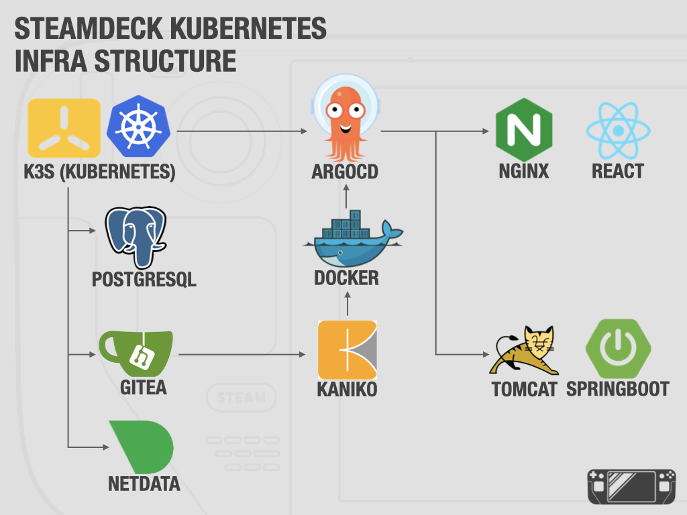
  

#### 🌐 적용 소프트웨어

* **TerraForm (IaC):** 코드로 인프라를 생성하고 관리하는 인프라 자동화 도구입니다. 스팀덱 내부의 가상 리소스나 네트워크 설정을 수동으로 구성하지 않고, 선언적인 코드를 통해 일관성 있게 배포하고 복구합니다.
* **Cursor AI (AI-Native IDE):** 프로젝트 전체 문맥(Context)을 이해하고 코드를 생성하는 차세대 AI 개발 환경입니다. 단순한 코드 작성을 넘어, 비즈니스 로직 구현부터 설정파일 검토등에 활용할 수 있습니다.
* **SpringBoot (Backend):** 자바 기반의 표준 웹 애플리케이션 프레임워크입니다. 빠른 개발 속도와 높은 확장성을 바탕으로 실제 비즈니스 로직을 구동합니다.
* React (Frontend):** 컴포넌트 기반의 현대적인 사용자 인터페이스(UI) 구축을 위한 자바스크립트 라이브러리입니다. 가상 DOM(Virtual DOM)을 활용한 고성능 렌더링을 통해 사용자에게 끊김 없는 최적의 웹 경험을 제공합니다.
* **PostgreSQL (Database):** 엔터프라이즈급 오픈소스 RDBMS입니다. 강력한 데이터 무결성을 제공하며 서비스의 모든 데이터를 안전하게 관리합니다.
* **K3s (Orchestration):** CNCF 인증을 받은 경량화된 쿠버네티스입니다. 단일 노드(스팀덱) 환경에 최적화되어 있으면서도 표준 쿠버네티스의 모든 기능을 수행합니다.
* **Gitea (SCM & Registry):** 외부 의존성(GitHub 등)을 배제한 온프레미스 코드 저장소입니다. 빌드된 컨테이너 이미지를 보관하는 Registry 기능까지 통합 운영합니다.
* **Kaniko (Image Builder):** 도커 데몬 없이 컨테이너 이미지를 제작하는 보안 최적화 도구입니다. 리소스 점유율이 낮아 저사양 하드웨어에서도 안정적인 패키징이 가능합니다.
* **ArgoCD (GitOps):** 'Git에 기록된 상태'와 '실제 서비스 상태'를 강제로 일치시키는 배포 자동화 도구입니다. 설정 변경만으로 서비스 확장(Scaling)과 롤백을 처리합니다.
* **NetData (Monitoring):** 시스템 리소스를 초 단위로 추적하는 실시간 성능 모니터링 도구입니다. 대중적인 Prometheus보다 훨씬 가볍고 설치가 간편하여, 자원이 한정된 스팀덱 환경에서도 CPU, 메모리, 네트워크 상태를 지연 없이 시각화해 줍니다.

---

<b>TerraForm - 테라폼 인프라 정의 파일</b>
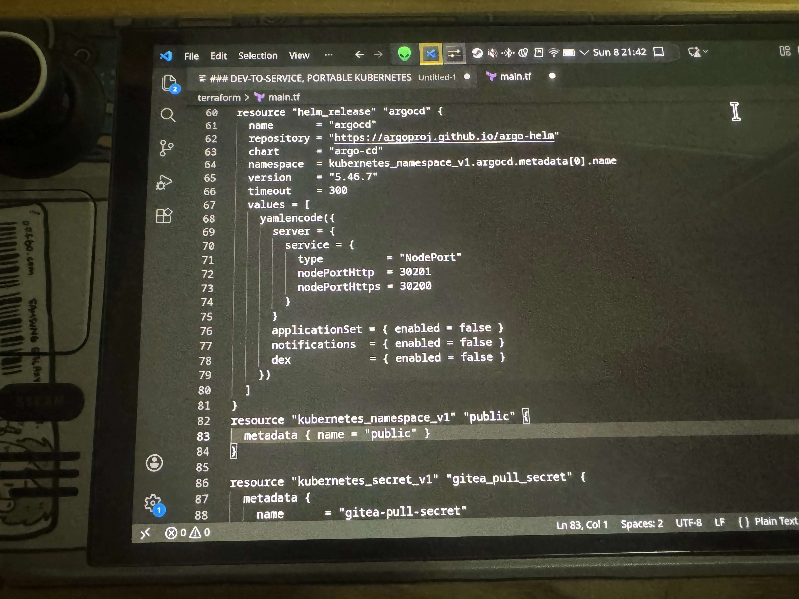

<b>K3s - 쿠버네티스 파드 정보</b>
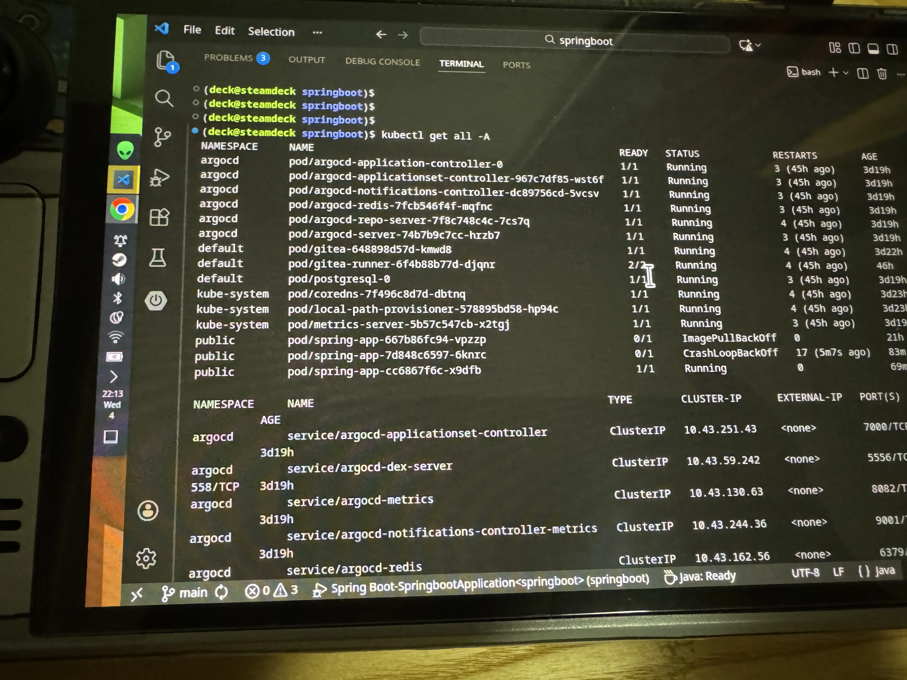

<b>PostgreSql, DBeaver - 데이터베이스</b>

<b>Cursor AI, 프로젝트 로컬/운영 환경 분리 코드 수정</b>
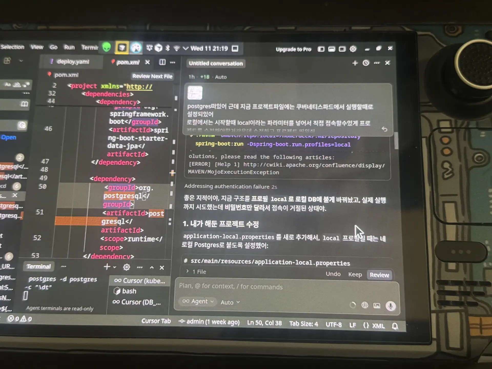

<b>SpringBoot - 백엔드 프로젝트 소스</b>
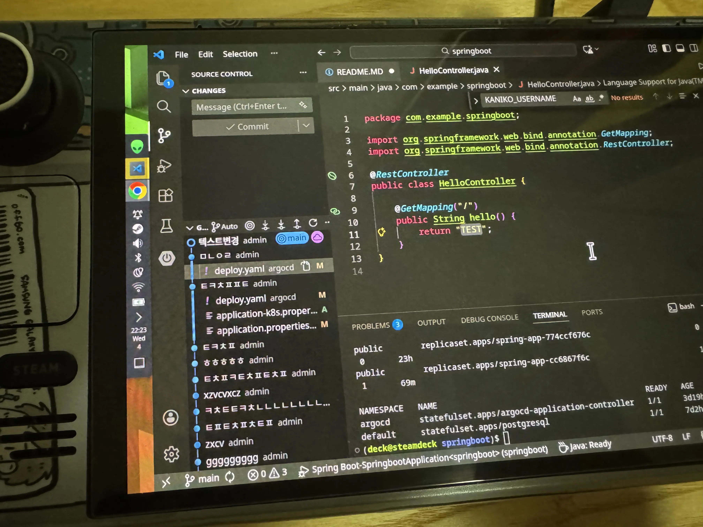

<b>Gitea - 소스코드 저장소</b>
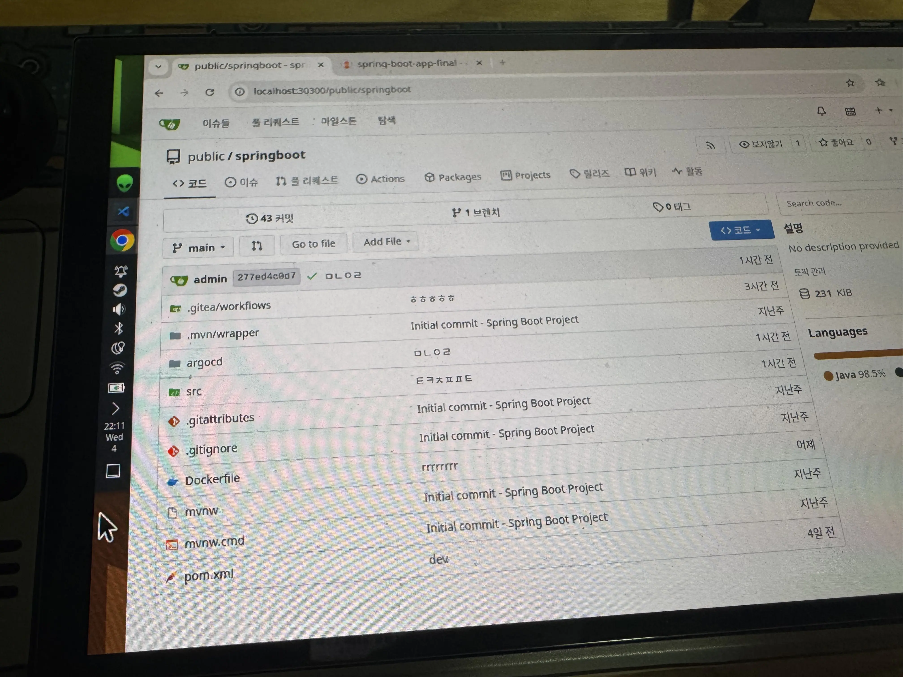

<b>GiteaAction - 소스코드 빌드</b>
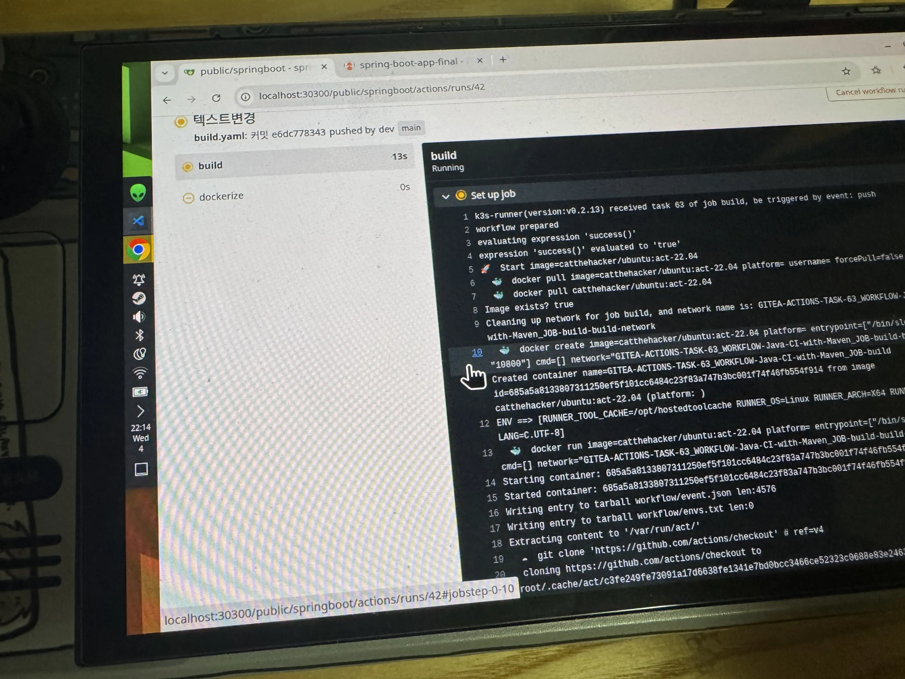

<b>GiteaAction, Kaniko - 도커라이징, 컨테이너 등록</b>
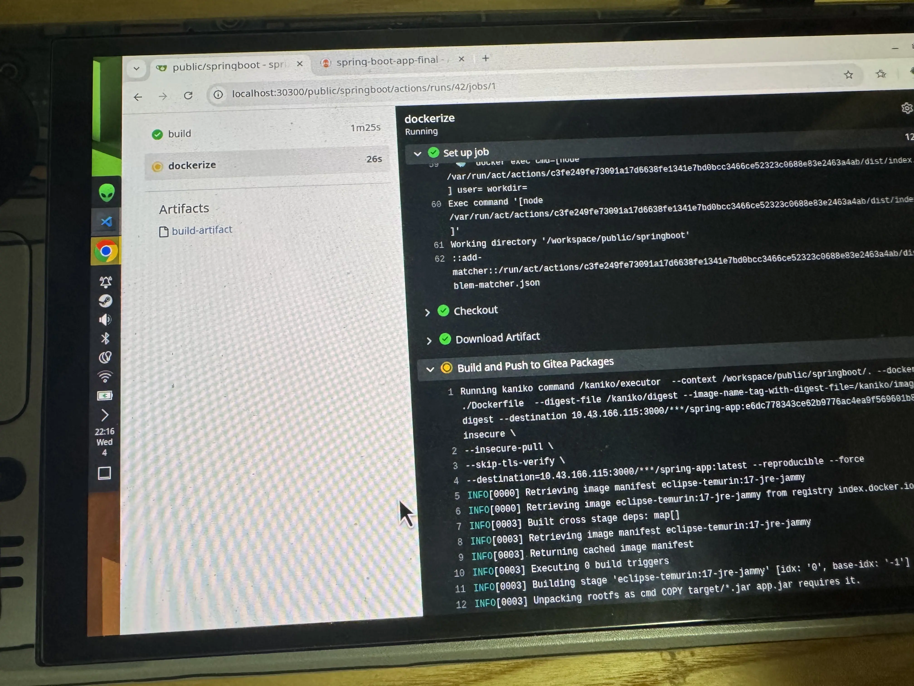

<b>Gitea - 컨테이너 레지스트리</b>
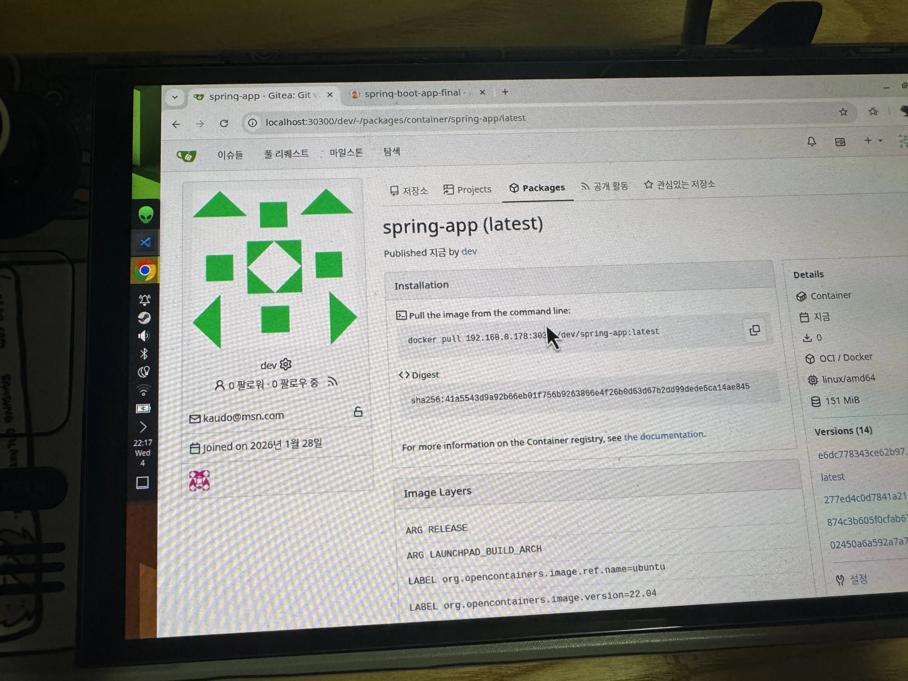

<b>ArgoCD - 최신 컨테이너로 파드 생성</b>
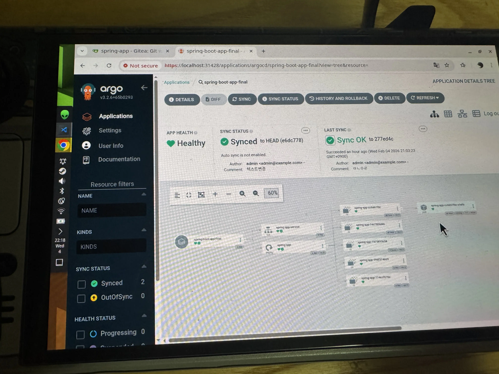

<b>ArgoCD - 스프링부트 파드 스타트</b>
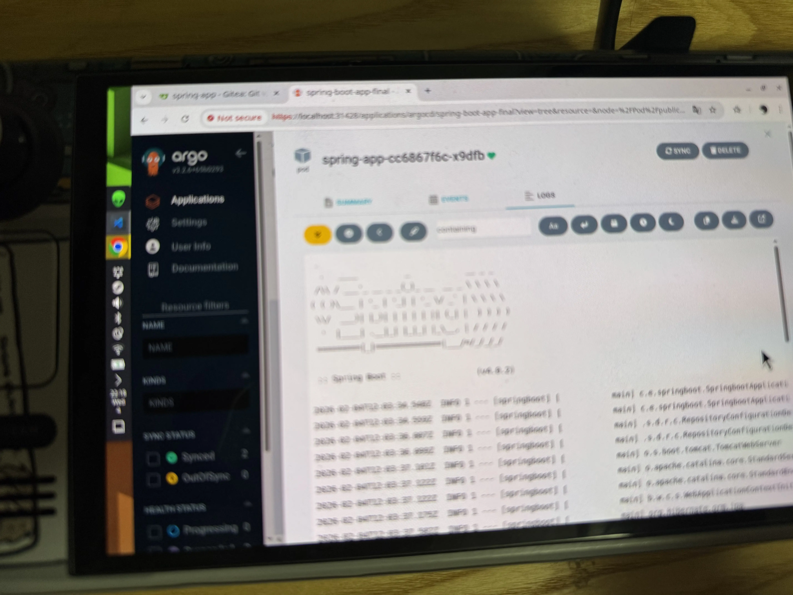

<b>ArgoCD - 3개의 파드로 스케일링</b>
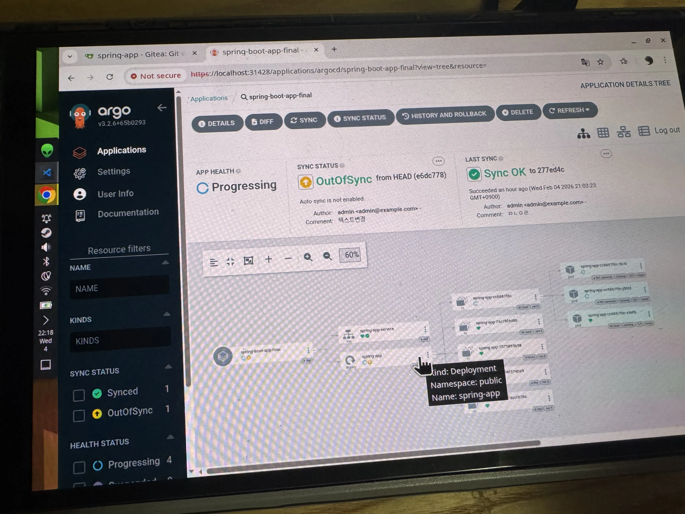

<b>Chrome - 스프링부트 프로젝트 접속</b>
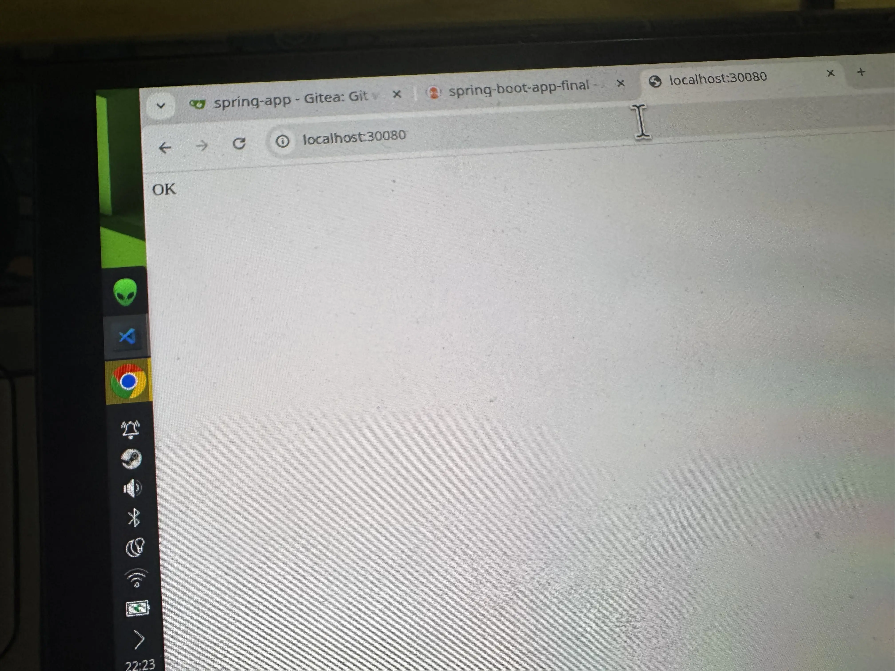

#### 🏗️ 엔터프라이즈 기술 매핑
| 분류 | 적용 기술 | 기업용 솔루션 대응 |
| :-- | :-- | :--- |
| **Infrastructure** | **Terraform** | **Terraform, CloudFormation** |
| **Kubenetes** | **K3s** | **Kubernetes, EKS** |
| **Repository** | **Gitea** | **GIT, SVN, GitLab, GitHub** |
| **Build** | **Gitea-Action** | **Jenkins, CodePipeline** |
| **Packaging** | **Kaniko** | **Docker, CodeBuild** |
| **Container** | **Gitea** | **DockerHub, ECR** |
| **Deploy** | **ArgoCD** | **Flux, Kubernetes, Docker** |
| **Observability** | **Netdata** | **Datadog, Prometheus/Grafana** |

#### 💻 기업용 서버 vs 스팀덱 스펙
| 항목 | 일반 기업용 서버 (최소) | Steam Deck (본 환경) |
| :--- | :--- | :--- |
| **CPU** | Multiple Xeon / EPYC 코어 | **AMD Zen 2 (4Core/8Thread)** |
| **RAM** | 8GB ~ 128GB+ | **16GB LPDDR5 (Shared)** |
| **OS** | RedHat / AM2 / Ubuntu | **SteamOS (Arch Linux)** |
| **Storage** | NVMe RAID / SAN | **Internal NVMe + SD Card** |

---

